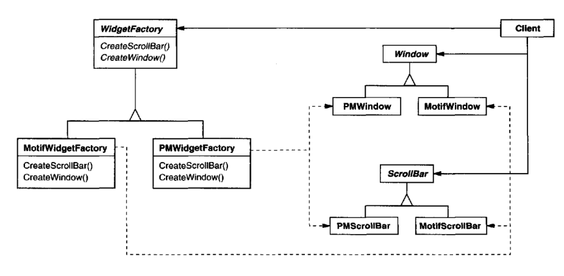
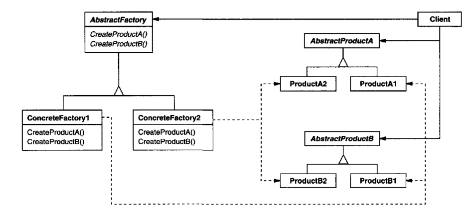

# Abstract Factory

## Intent

Provide an interface for creating families of related or dependent objects without
specifying their concrete classes.

## Also Known As

Kit

## Motivation

Consider a user interface toolkit that supports multiple look-and-feel standards,
such as Motif and Presentation Manager. Different look-and-feels define different
appearances and behaviors for user interface "widgets" like scroll bars, windows,
and buttons. To be portable across look-and-feel standards, an application should
not hard-code its widgets for a particular look and feel. Instantiating look-and-
feel-specific classes of widgets throughout the application makes it hard to change
the look and feel later.

We can solve this problem by defining an abstract WidgetFactory class that 
declares an interface for creating each basic kind of widget. There's also an abstract
class for each kind of widget, and concrete subclasses implement widgets for
specific look-and-feel standards. WidgetFactory's interface has an operation that
returns a new widget object for each abstract widget class. Clients call these 
operations to obtain widget instances, but clients aren't aware of the concrete classes
they're using. Thus clients stay independent of the prevailing look and feel.

There is a concrete subclass of WidgetFactory for each look-and-feel standard.
Each subclass implements the operations to create the appropriate widget for the
look and feel. For example, the CreateScrollBar operation on the MotifWidgetFac-
tory instantiates and returns a Motif scroll bar, while the corresponding operation
on the PMWidgetFactory returns a scroll bar for Presentation Manager. Clients
create widgets solely through the WidgetFactory interface and have no knowl-
edge of the classes that implement widgets for a particular look and feel. In other
words, clients only have to commit to an interface defined by an abstract class,
not a particular concrete class.

A WidgetFactory also enforces dependencies between the concrete widget classes.
A Motif scroll bar should be used with a Motif button and a Motif text editor, and
that constraint is enforced automatically as a consequence of using a MotifWid-
getFactory.

## Applicability

Use the Abstract Factory pattern when
* a system should be independent of how its products are created, composed,
and represented.
* a system should be configured with one of multiple families of products.
* a family of related product objects is designed to be used together, and you
need to enforce this constraint.
* you want to provide a class library of products, and you want to reveal just
their interfaces, not their implementations.

## Structure

