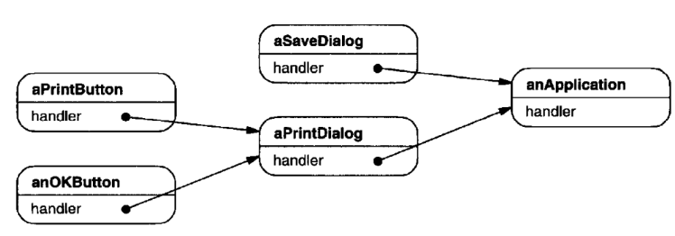
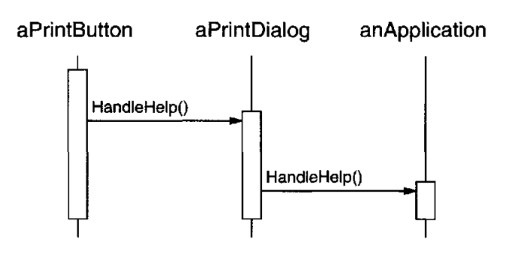
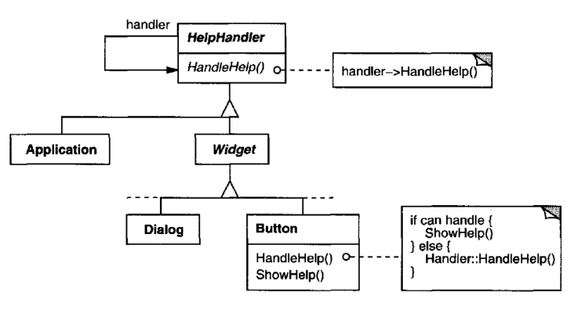

# Chain Of Responsibility

## Intent

Avoid coupling the sender of a request to its receiver by giving more than one
object a chance to handle the request. Chain the receiving objects and pass the
request along the chain until an object handles it.

## Motivation

Consider a context-sensitive help facility for a graphical user interface.The user
can obtain help information on any part of the interface just by clicking on it.
The help that's provided depends on the part of the interface that's selected and
its context; for example, a button widget in a dialog box might have different
help information than a similar button in the main window. If no specific help
information exists for that part of the interface, then the help system should
display a more general help message about the immediate context—the dialog
box as a whole, for example.

Hence it's natural to organize help information according to its generality—from
the most specific to the most general. Furthermore, it's clear that a help request
is handled by one of several user interface objects; which one depends on the
context and how specific the available help is.

The problem here is that the object that ultimately provides the help isn't known
explicitly to the object (e.g., the button) that initiates the help request. What we
need is a way to decouple the button that initiates the help request from the objects
that might provide help information. The Chain of Responsibility pattern defines
how that happens.

The idea of this pattern is to decouple senders and receivers by giving multiple
objects a chance to handle a request. The request gets passed along a chain of
objects until one of them handles it.

The first object in the chain receives the request and either handles it or forwards
it to the next candidate on the chain, which does likewise. The object that made
the request has no explicit knowledge of who will handle it—we say the request
has an implicit receiver.

Let's assume the user clicks for help on a button widget marked "Print." The
button is contained in an instance of PrintDialog, which knows the application
object it belongs to (see preceding object diagram). The following interaction
diagram illustrates how the help request gets forwarded along the chain:

In this case, neither aPrintButton nor aPrintDialog handles the request; it stops at
anApplication, which can handle it or ignore it. The client that issued the request
has no direct reference to the object that ultimately fulfills it.

To forward the request along the chain, and to ensure receivers remain implicit,
each object on the chain shares a common interface for handling requests and for
accessing its successor on the chain. For example, the help system might define
a HelpHandler class with a corresponding HandleHelp operation. HelpHandler
can be the parent class for candidate object classes, or it can be defined as a mixin
class. Then classes that want to handle help requests can make HelpHandler a
parent:

TheButton,Dialog, and Application classes useHelpHandler operations to handle
help requests. HelpHandler's HandleHelp operation forwards the request to the
successor by default.Subclasses can override this operation to provide help under
the right circumstances; otherwise they can use the default implementation to
forward the request.

## Applicability

Use Chain of Responsibility when
* more than one object may handle a request, and the handler isn't known a
priori. The handler should be ascertained automatically.
* you want to issue a request to one of several objects without specifying the
receiver explicitly.
* the set of objects that can handle a request should be specified dynamically.

## Structure

A typical object structure might look like this:

