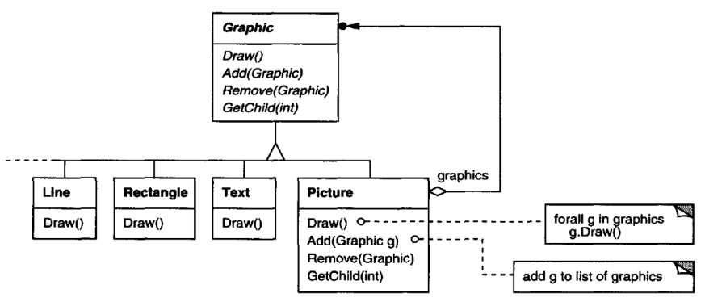
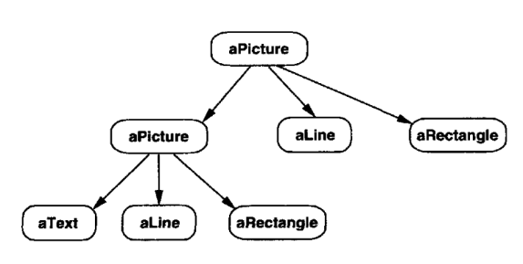
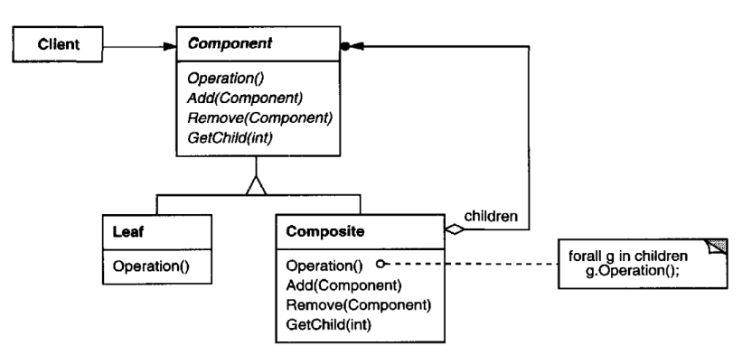

# Composite

## Intent

Compose objects into tree structures to represent part-whole hierarchies. 
Composite lets clients treat individual objects and compositions of objects uniformly.

## Motivation

Graphics applications like drawing editors and schematic capture systems let
users build complex diagrams out of simple components. The user can group
components to form larger components,which in turn can be grouped to form still
larger components. A simple implementation could define classes for graphical
primitives such as Text and Lines plus other classes that act as containers for these
primitives.

But there's a problem with this approach: Code that uses these classes must treat
primitive and container objects differently, even if most of the time the user treats
them identically.Having to distinguish these objects makes the application more
complex. The Composite pattern describes how to use recursive composition so
that clients don't have to make this distinction.

The key to the Composite pattern is an abstract class that represents both 
primitives and their containers. For the graphics system, this class is Graphic.Graphic
declares operations like Draw that are specific to graphical objects. It also declares
operations that all composite objects share, such as operations for accessing and
managing its children.

The subclasses Line, Rectangle, and Text (see preceding class diagram) define
primitive graphical objects.These classes implement Draw to draw lines, 
rectangles, and text, respectively. Since primitive graphics have no child graphics, none
of these subclasses implements child-related operations.
The Picture class defines an aggregate of Graphic objects. Picture implements

Draw to call Draw on its children, and it implements child-related operations 
accordingly. Because the Picture interface conforms to the Graphic interface,Picture
objects can compose other Pictures recursively.

The following diagram shows a typical composite object structure of recursively
composed Graphic objects:

## Applicability

Use the Composite pattern when
* you want to represent part-whole hierarchies of objects.
* you want clients to be able to ignore the difference between composition sof
objects and individual objects.Clients will treat all objects in the composite
structure uniformly.

## Structure

