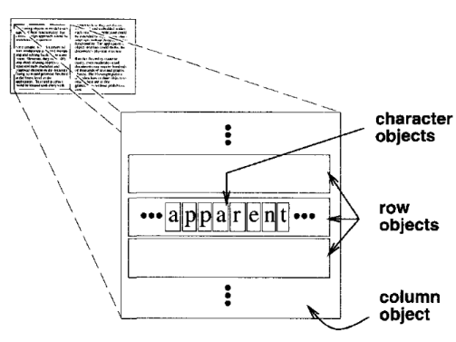
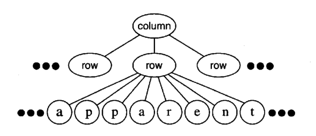
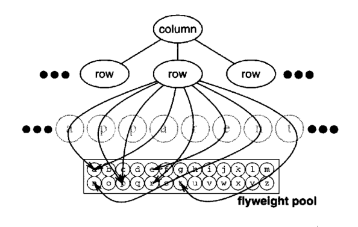
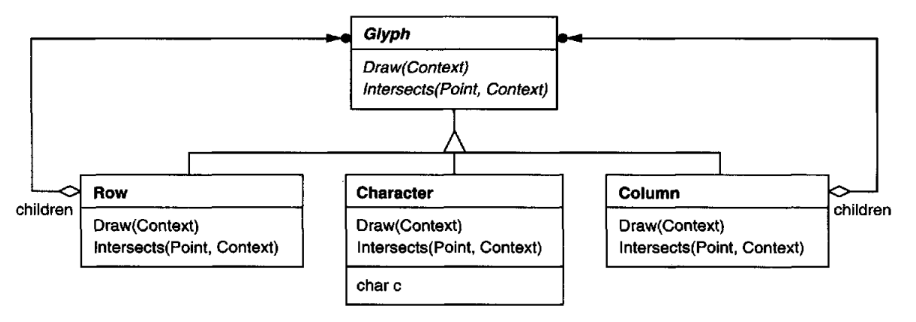
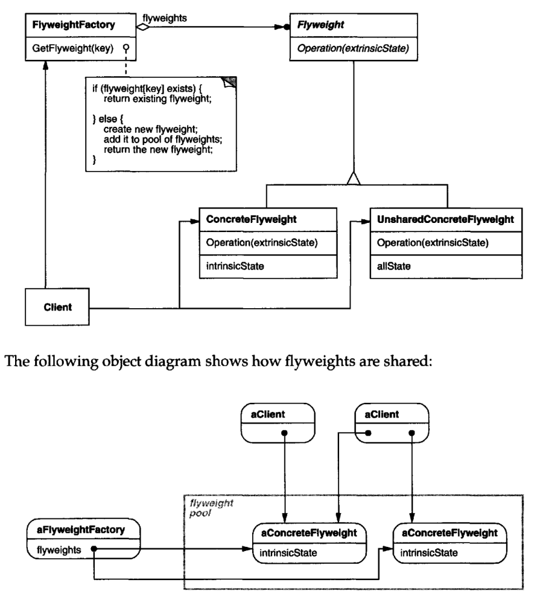

# Flyweight

## Intent

Use sharing to support large numbers of fine-grained objects efficiently.

## Motivation

Some applications could benefit from using objects throughout their design, but
a naive implementation would be prohibitively expensive.

For example, most document editor implementations have text formatting and
editing facilities that are modularized to some extent.Object-oriented document
editors typically use objects to represent embedded elements like tables and 
figures. However, they usually stop short of using an object for each character in the
document, even though doing so would promote flexibility at the finest levels in
the application. Characters and embedded elements could then be treated 
uniformly with respect to how they are drawn and formatted. The application could
be extended to support new character sets without disturbing other functionality.
The application's object structure could mimic the document's physical structure.
The following diagram shows how a document editor can use objects to represent
characters.

The drawback of such a design is its cost. Even moderate-sized documents may
require hundreds of thousands of character objects, which will consume lots of
memory and may incur unacceptable run-time overhead. The Flyweight pattern
describes how to share objects to allow their use at fine granularities without
prohibitive cost.

A flyweight is a shared object that can be used in multiple contexts simultaneously.
The flyweight acts as an independent object in each context—it's indistinguishable 
from an instance of the object that's not shared. Flyweights cannot make
assumptions about the context in which they operate. The key concept here is the
distinction between intrinsic and extrinsic state. Intrinsic state is stored in the
flyweight; it consists of information that's independent of the flyweight's context,
thereby making it sharable. Extrinsic state depends on and varies with the 
flyweight's context and therefore can't be shared. Client objects are responsible for
passing extrinsic state to the flyweight when it needs it.

Flyweights model concepts or entities that are normally too plentiful to represent
with objects.For example, a document editor can create a flyweight for each letter
of the alphabet. Each flyweight stores a character code, but its coordinate position
in the document and its typographic style can be determined from the text layout
algorithms and formatting commands in effect wherever the character appears.
The character code is intrinsic state, while the other information is extrinsic.

Logically there is an object for every occurrence of a given character in the document:

Physically, however, there is one shared flyweight object per character, and it
appears in different contexts in the document structure. Each occurrence of a 
particular character object refers to the same instance in the shared pool of flyweight
objects:

The class structure for these objects is shown next. Glyph is the abstract class for
graphical objects, some of which may be flyweights.Operations that may depend
on extrinsic state have it passed to them as a parameter. For example, Draw and
Intersects must know which context the glyph is in before they can do their job.

A flyweight representing the letter "a" only stores the corresponding character
code; it doesn't need to store its location or font. Clients supply the 
context dependent information that the flyweight needs to draw itself. For example, a
Row glyph knows where its children should draw themselves so that they are
tiled horizontally. Thus it can pass each child its location in the draw request.

Because the number of different character objects is far less than the number of
characters in the document, the total number of objects is substantially less than
what a naive implementation would use. A document in which all characters appear 
in the same font and color will allocate on the order of 100 character objects
(roughly the size of the ASCII character set) regardless of the document's length.
And since most documents use no more than 10 different font-color 
combinations, this number won't grow appreciably in practice.An object abstraction thus
becomes practical for individual characters.

## Applicability

The Flyweight pattern's effectiveness depends heavily on how and where it's
used. Apply the Flyweight pattern when all of the following are true:
* An application uses a large number of objects.
* Storage costs are high because of the sheer quantity of objects.
* Most object state can be made extrinsic.
* Many groups of objects may be replaced by relatively few shared objects
once extrinsic state is removed.
* The application doesn't depend on object identity. Since flyweight objects
may be shared, identity tests will return true for conceptually distinct objects.

## Structure

