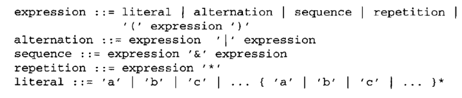
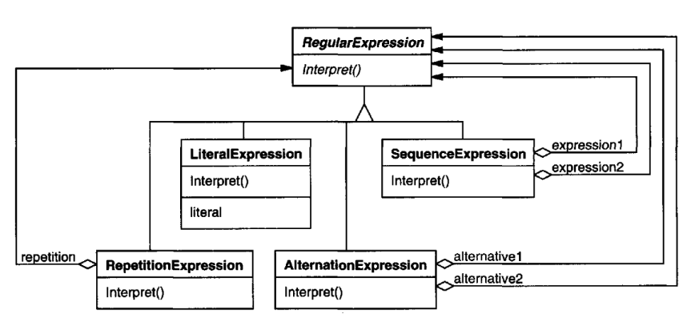
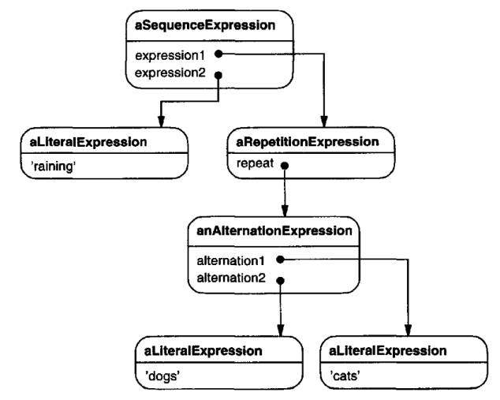
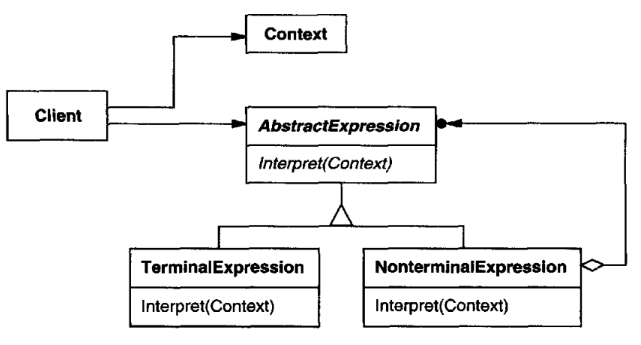

# Interpreter

## Intent

Given a language, define a represention for its grammar along with an interpreter
that uses the representation to interpret sentences in the language.

## Motivation

If a particular kind of problem occurs often enough, then it might be worthwhile
to express instances of the problem as sentences in a simple language. Then you
can build an interpreter that solves the problem by interpreting these sentences.

For example, searching for strings that match a pattern is a common problem.
Regular expressions are a standard language for specifying patterns of strings.
Rather than building custom algorithms to match each pattern against strings,
search algorithms could interpret a regular expression that specifies a set of strings
to match.

The Interpreter pattern describes how to define a grammar for simple languages,
represent sentences in the language, and interpret these sentences.In this example,
the pattern describes how to define a grammar for regular expressions, represent
a particular regular expression, and how to interpret that regular expression.
Suppose the following grammar defines the regular expressions:



The symbol expression is the start symbol, and literal is a terminal symbol
defining simple words

The Interpreter pattern uses a class to represent each grammar rule. Symbols on
the right-hand side of the rule are instance variables of these classes. The grammar
above is represented by five classes: an abstract class RegularExpression and its
four subclasses LiteralExpression, AlternationExpression, SequenceExpression,
and RepetitionExpression. The last three classes define variables that hold subexpressions.



Every regular expression defined by this grammar is represented by an abstract
syntax tree made up of instances of these classes. For example, the abstract syntax
tree



represents the regular expression
    
```raining & (dogs | cats) *```

We can create an interpreter for these regular expressions by defining the Interpret
operation on each subclass of RegularExpression.Interpret takes as an argument
the context in which to interpret the expression. The context contains the input
string and information on how much of it has been matched so far. Each subclass
of RegularExpression implements Interpret to match the next part of the input
string based on the current context. For example,

* LiteralExpression will check if the input matches the literal it defines,
* AlternationExpression will check if the input matches any of its alternatives,
* RepetitionExpression will check if the input has multiple copies of expression
it repeats,

and so on.

## Applicability

Use the Interpreter pattern when there is a language to interpret, and you can
represent statements in the language as abstract syntax trees. The Interpreter
pattern works best when
* the grammar is simple. For complex grammars, the class hierarchy for the
grammar becomes large and unmanageable. Tools such as parser generators
are a better alternative in such cases. They can interpret expressions without
building abstract syntax trees, which can save space and possibly time.
* efficiency is not a critical concern. The most efficient interpreters are usually
not implemented by interpreting parse trees directly but by first translating
them into another form. For example, regular expressions are often 
transformed into state machines. But even then, the translator can be implemented
by the Interpreter pattern, so the pattern is still applicable.

## Structure


