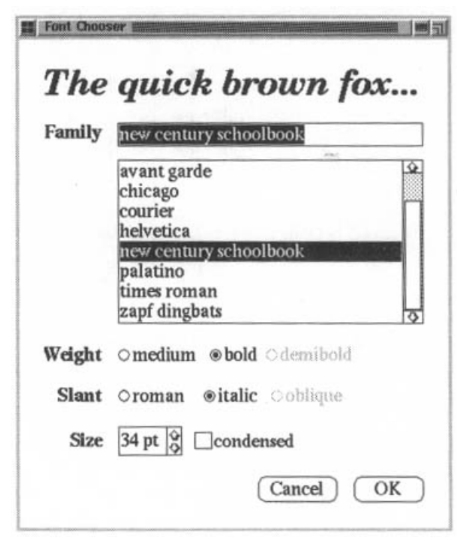
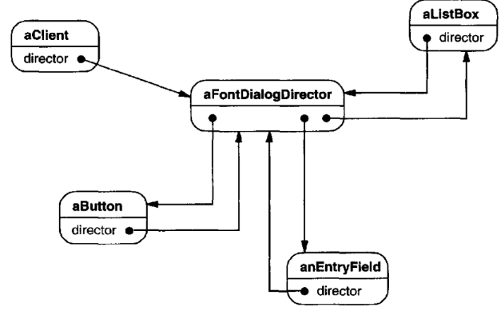
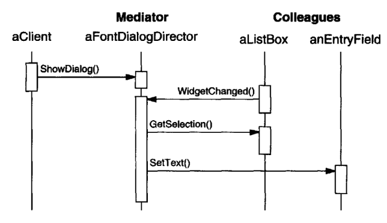
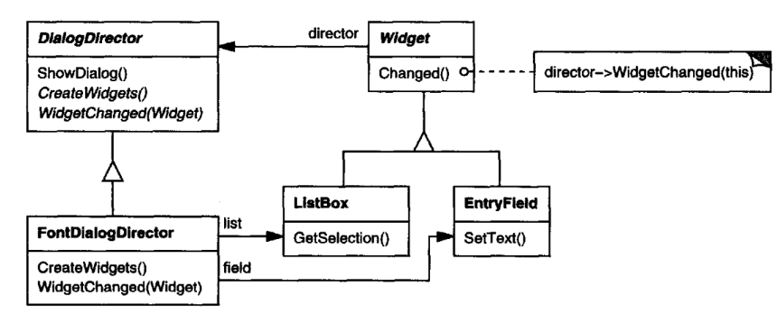
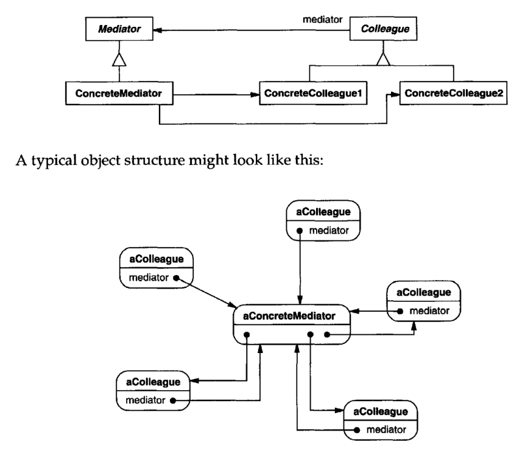

# Mediator

## Intent

Define an object that encapsulate show a set of objects interact. Mediator promotes
loose coupling by keeping objects from referring to each other explicitly, and it
lets you vary their interaction independently.

## Motivation

Object-oriented design encourages the distribution of behavior among objects.
Such distribution can result in an object structure with many connections between
objects; in the worst case, every object ends up knowing about every other.

Though partitioning a system into many objects generally enhances reusability,
proliferating interconnections tend to reduce it again. Lots of interconnections
make it less likely that an object can work without the support of others—the
system acts as though it were monolithic. Moreover, it can be difficult to change
the system's behavior in any significant way,since behavior is distributed among
many objects. As a result, you may be forced to define many subclasses to 
customize the system's behavior.

As an example, consider the implementation of dialog boxes in a graphical user
interface. A dialog box uses a window to present a collection of widgets such as
buttons, menus, and entry fields, as shown here:

Often there are dependencies between the widgets in the dialog. For example,
a button gets disabled when a certain entry field is empty. Selecting an entry
in a list of choices called a list box might change the contents of an entry field.
Conversely typing text into the entry field might automatically select one or more
corresponding entries in the list box. Once text appears in the entry field, other
buttons may become enabled that let the user do something with the text,such as
changing or deleting the thing to which it refers.

Different dialog boxes will have different dependencies between widgets. So even
though dialogs display the same kinds of widgets, they can't simply reuse stock
widget classes; they have to be customized to reflect dialog-specific dependencies.
Customizing them individually by subclassing will be tedious, since many classes
are involved.

You can avoid these problems by encapsulating collective behavior in a separate
mediator object. A mediator is responsible for controlling and coordinating the
interactions of a group of objects. The mediator serves as an intermediary that
keeps objects in the group from referring to each other explicitly. The objects only
know the mediator, thereby reducing the number of interconnections.

For example, FontDialogDirector can be the mediator between the widgets in
a dialog box. A FontDialogDirector object knows the widgets in a dialog and
coordinates their interaction. It acts as a hub of communication for widgets:

The following interaction diagram illustrates how the objects cooperate to handle
a change in a list box's selection:

Here's the succession of events by which a list box's selection passes to an entry
field:
1. The list box tells its director that it's changed.
2. The director gets the selection from the list box.
3. The director passes the selection to the entry field.
4. Now that the entry field contains some text, the director enables button(s)
   for initiating an action (e.g., "demibold," "oblique").

Note how the director mediates between the list box and the entry field. Widgets
communicate with each other only indirectly, through the director. They don't 
have tok now about each other; all they know is the director.Furthermore,because
the behavior is localized in one class, it can be changed or replaced by extending
or replacing that class.
Here's how the FontDialogDirector abstraction can be integrated into a class
library:

DialogDirector is an abstract class that defines the overall behavior of a 
dialog. Clients call the ShowDialog operation to display the dialog on the screen.
CreateWidgets is an abstract operation for creating the widgets of a dialog. Wid-
getChanged is another abstract operation; widgets call it to inform their director
that they have changed. DialogDirector subclasses override CreateWidgets to 
create the proper widgets, and they override WidgetChanged to handle the changes.

## Applicability

Use the Mediator pattern when
* a set of objects communicate in well-defined but complex ways.The resulting
interdependencies are unstructured and difficult to understand.
* reusing an object is difficult because it refers to and communicates with many
other objects.
+ a behavior that's distributed between several classes should be customizable
without a lot of subclassing.

## Structure

