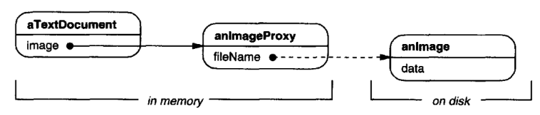
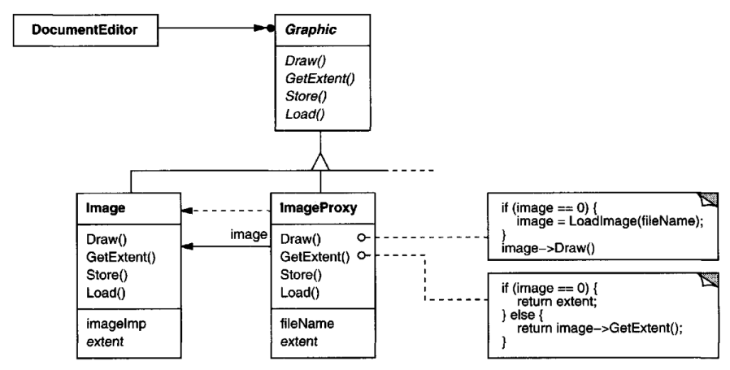
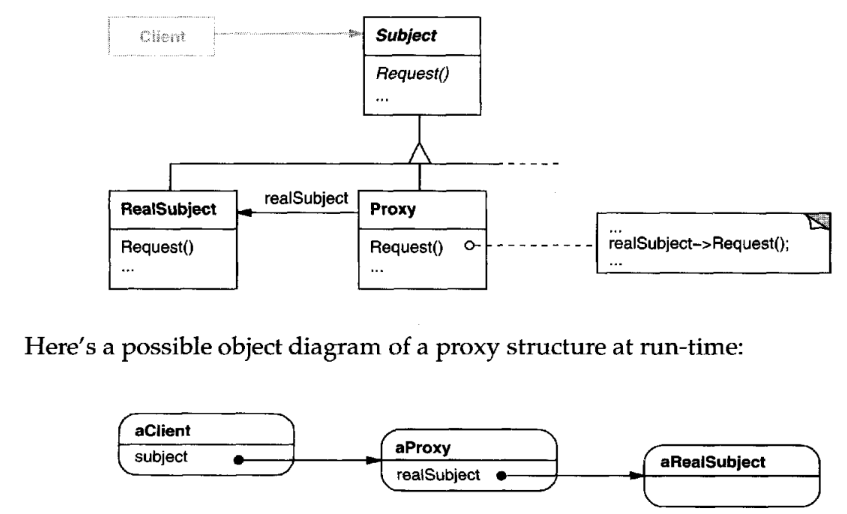

# Proxy

## Intent

Provide a surrogate or placeholder for another object to control access to it.

## Also Known As

Surrogate

## Motivation

One reason for controlling access to an object is to defer the full cost of its creation
and initialization until we actually need to use it. Consider a document editor
that can embed graphical objects in a document. Some graphical objects, like large
raster images, can be expensive to create.But opening a document should be fast,
so we should avoid creating all the expensive objects at once when the document
is opened. This isn't necessary anyway, because not all of these objects will be
visible in the document at the same time.

These constraints would suggest creating each expensive object on demand, which
in this case occurs when an image becomes visible. But what do we put in the
document in place of the image? And how can we hide the fact that the image is
created on demand so that we don't complicate the editor's implementation? This
optimization shouldn't impact the rendering and formatting code, for example.

The solution is to use another object, an image proxy, that acts as a stand-in for
the real image. The proxy acts just like the image and takes care of instantiating it
when it's required.

The image proxy creates the real image only when the document editor asks it
to display itself by invoking its Draw operation. The proxy forwards subsequent
requests directly to the image.It must therefore keep a reference to the image after
creating it.

Let's assume that images are stored in separate files. In this case we can use the
file name as the reference to the real object. The proxy also stores its extent, that
is, its width and height. The extent lets the proxy respond to requests for its size
from the formatter without actually instantiating the image.

The following class diagram illustrates this example in more detail.

The document editor accesses embedded images through the interface defined by
the abstract Graphic class. ImageProxy is a class for images that are created on
demand. ImageProxy maintains the file name as a reference to the image on disk.
The file name is passed as an argument to the ImageProxy constructor.

ImageProxy also stores the bounding box of the image and a reference to the
real Image instance. This reference won't be valid until the proxy instantiates
the real image. The Draw operation makes sure the image is instantiated before
forwarding it the request. GetExtent forwards the request to the image only if it's
instantiated; otherwise ImageProxy returns the extent it stores.

## Applicability

Proxy is applicable whenever there is a need for a more versatile or sophisticated
reference to an object than a simple pointer. Here are several common situations
in which the Proxy pattern is applicable:
1. A remote proxy provides a local representative for an object in a different
   address space. NEXTSTEP [Add94] uses the class NXProxy for this purpose.
   Coplien [Cop92]calls this kind of proxy an "Ambassador."
2. A virtual proxy creates expensive objects on demand. The ImageProxy 
   described in the Motivation is an example of such a proxy.
3. A protection proxy controls access to the original object. Protection proxies
   are useful when objects should have different access rights. For example,
   KernelProxies in the Choices operating system [CIRM93] provide protected
   access to operating system objects.
4. A smart reference is a replacement for a bare pointer that performs additional
   actions when an object is accessed. Typical uses include
   * counting the number of references to the real object so that it can be
   freed automatically when there are no more references (also called smart
   pointers [Ede92]).
   * loading a persistent object into memory when it's first referenced.
   * checking that the real object is locked before it's accessed to ensure that
   no other object can change it.

## Structure

