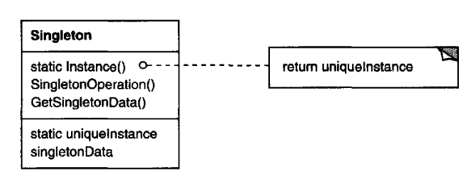

# Singleton

## Intent

Ensure a class only has one instance, and provide a global point of access to it.

## Motivation

It's important for some classes to have exactly one instance.Although there can be
many printers in a system, there should be only one printer spooler. There should
be only one file system and one window manager. A digital filter will have one
A/D converter. An accounting system will be dedicated to serving one company.

How do we ensure that a class has only one instance and that the instance is easily
accessible? A global variable makes an object accessible, but it doesn't keep you
from instantiating multiple objects.

A better solution is to make the class itself responsible for keeping track of its sole
instance.The class can ensure that no other instance can be created (by intercepting
requests to create new objects), and it can provide a way to access the instance.
This is the Singleton pattern.

## Applicability

Use the Singleton pattern when
* there must be exactly one instance of a class, and it must be accessible to
clients from a well-known access point.
* when the sole instance should be extensible by subclassing, and clients
should be able to use an extended instance without modifying their code.

## Structure

