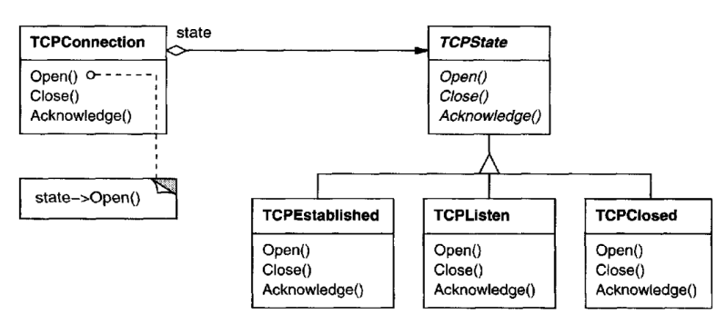
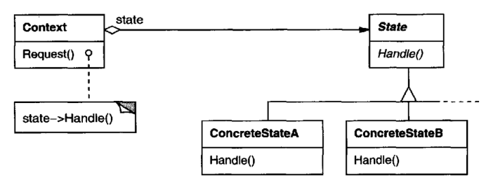

# State

## Intent

Allow an object to alter its behavior when its internal state changes. The object
will appear to change its class.

## Also Known As

Objects for States

## Motivation

Consider a class TCPConnection that represents a network connection. A 
TCP-Connection object can be in one of several different states: Established, Listening,
Closed. When a TCPConnection object receives requests from other objects, it
responds differently depending on its current state. For example, the effect of an
Open request depends on whether the connection isin itsClosed state or its 
Established state. The State pattern describes how TCPConnection can exhibit different
behavior in each state.

The key idea in this pattern is to introduce an abstract class called TCPState
to represent the states of the network connection. The TCPState class declares
an interface common to all classes that represent different operational states.
Subclasses of TCPState implement state-specific behavior. For example, the classes
TCPEstablished and TCPClosed implement behavior particular to the Established
and Closed states of TCPConnection.

The class TCPConnection maintains a state object (an instance of a subclass of
TCPState) that represents the current state of the TCP connection. The class
Connection delegates allstate-specific requests to this state object. TCPConnection
uses its TCPState subclass instance to perform operations particular to the state
of the connection.

Whenever the connection changes state, the TCPConnection object changes the
state object it uses.When the connection goes from established to closed, for 
example, TCPConnection will replace its TCPEstablished instance with a TCPClosed
instance.

## Applicability

Use the State pattern in either of the following cases:
* An object's behavior depends on its state, and it must change its behavior at
run-time depending on that state.
* Operations have large, multipart conditional statements that depend on the
object's state. This state is usually represented by one or more enumerated
constants. Often, several operations will contain this same conditional 
structure. The State pattern puts each branch of the conditional in a separate class.
This lets you treat the object's state as an object in its own right that can vary
independently from other objects.

## Structure

