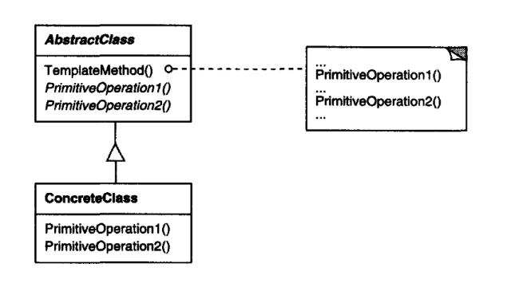

# Template Method

## Intent

Define the skeleton of an algorithm in an operation, deferring some steps to
subclasses.Template Method lets subclasses redefine certain steps of an algorithm
without changing the algorithm's structure.

## Motivation

Consider an application framework that provides Application and Document
classes.The Application classes responsible for opening existing documents stored
in an external format, such as a file. A Document object represents the information
in a document once it's read from the file.

Applications built with the framework can subclass Application and Document to
suit specific needs. For example, a drawing application defines DrawApplication
and DrawDocument subclasses; a spreadsheet application defines SpreadsheetApplication
and SpreadsheetDocument subclasses.


The abstract Application class defines the algorithm for opening and reading a
document in its OpenDocument operation:

```
void Application::OpenDocument (const char* name) {
    if (!CanOpenDocument(name)) {
        // cannot handle this document
        return;
    }
    Document* doc = DoCreateDocument();
    if (doc) {
        _docs->AddDocument(doc);
        AboutToOpenDocument(doc);
        doc->Open();
        doc->DoRead();
    }
}
```

OpenDocument defines each step for opening a document. It checks if the document 
can be opened, creates the application-specific Document object, adds it to
its set of documents, and reads the Document from a file.

We call OpenDocument a template method. A template method defines an algorithm 
in terms of abstract operations that subclasses override to provide concrete
behavior. Application subclasses define the steps of the algorithm that check if
the document can be opened (CanOpenDocument) and that create the Document
(DoCreateDocument). Document classes define the step that reads the document
(DoRead). The template method also defines an operation that lets Application
subclasses know when the document is about to be opened (AboutToOpenDocument), 
in case they care.

By defining some of the steps of an algorithm using abstract operations, 
the template method fixes their ordering, but it lets Application and 
Document subclasses vary those steps to suit their needs.

## Applicability
The Template Method pattern should be used
* to implement the invariant parts of an algorithm once and leave it up to
subclasses to implement the behavior that can vary.
* when common behavior among subclasses should be factored and localized
in a common class to avoid code duplication. This is a good example of
"refactoring to generalize" as described by Opdyke and Johnson.
You first identify the differences in the existing code and then separate the
differences into new operations. Finally, you replace the differing code with
a template method that calls one of these new operations.
* to control subclasses extensions. You can define a template method that calls
"hook" operations (see Consequences) at specific points, thereby permitting
extensions only at those points.

## Structure

