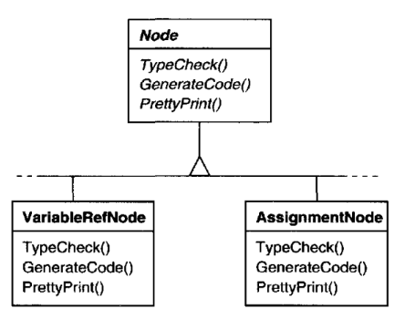
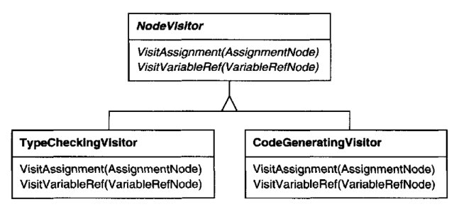
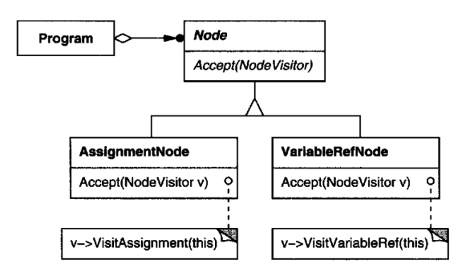
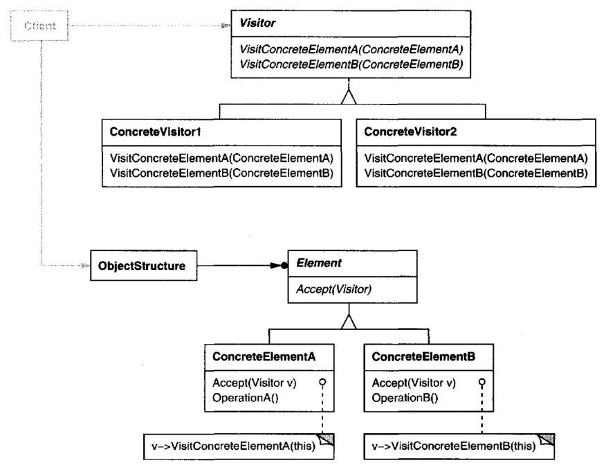

# Visitor

## Intent

Represent an operation to be performed on the elements of an object structure. 
Visitor lets you define a new operation without changing the classes of the elements
on which it operates.

## Motivation

Consider a compiler that represents programs as abstractsyntax trees. Itwill need
to perform operations on abstract syntax trees for "static semantic" analyses like
checking that all variables are defined.Itwill also need to generate code.Soit might
define operations for type-checking, code optimization, flow analysis, checking
for variables being assigned values before they're used, and so on. Moreover,
we could use the abstract syntax trees for pretty-printing, program restructuring,
code instrumentation, and computing various metrics of a program.

Most of these operations will need to treat nodes that represent assignment 
statements differently from nodes that represent variables or arithmetic expressions.
Hence there will be one class for assignment statements, another for variable
accesses, another for arithmetic expressions, and so on. The set of node classes
depends on the language being compiled, of course, but it doesn't change much
for a given language.

This diagram shows part of the Node class hierarchy. The problem here is that
distributing all these operations across the various node classes leads to a system
that's hard to understand, maintain, and change.It will be confusing to have 
typechecking code mixed with pretty-printing code or flow analysis code. Moreover,
adding a new operation usually requires recompiling all of these classes. It would
be better if each new operation could be added separately, and the node classes
were independent of the operations that apply to them.

We can have both by packaging related operations from each class in a separate
object, called a visitor, and passing it to elements of the abstract syntax tree as it's
traversed. When an element "accepts" the visitor, it sends a request to the visitor
that encodes the element's class. It also includes the element as an argument.The
visitor will then execute the operation for that element—the operation that used
to be in the class of the element.

For example, a compiler that didn't use visitors might type-check a procedure
by calling the TypeCheck operation on its abstract syntax tree. Each of the nodes
would implement TypeCheck by calling TypeCheck on its components (see the
preceding class diagram). If the compiler type-checked a procedure using visitors,
then it would create a TypeCheckingVisitor object and call the Accept operation
on the abstract syntax tree with that object as an argument. Each of the nodes
would implement Accept by calling back on the visitor: an assignment node
calls VisitAssignment operation on the visitor, while a variable reference calls
VisitVariableReference. What used to be the TypeCheck operation in class 
AssignmentNode is now the VisitAssignment operation onTypeCheckingVisitor.

To make visitors work for more than just type-checking,we need an abstract parent
class NodeVisitor for all visitors of an abstract syntax tree. NodeVisitor must
declare an operation for each node class. An application that needs to compute
program metrics will define new subclasses of NodeVisitor and will no longer
need to add application-specific code to the node classes. The Visitor pattern
encapsulates the operations for each compilation phase in a Visitor associated
with that phase.

With the Visitor pattern, you define two class hierarchies: one for the elements
being operated on (the Node hierarchy) and one for the visitors that define 
operations on the elements (theNodeVisitor hierarchy). You create a new operation
by adding a new subclass to the visitor class hierarchy. As long as the grammar
that the compiler accepts doesn't change (that is, we don't have to add new Node
subclasses), we can add new functionality simply by defining new NodeVisitor
subclasses.

## Applicability

Use the Visitor pattern when
* an object structure contains many classes of objects with differing interfaces,
and you want to perform operations on these objects that depend on their
concrete classes.
* many distinct and unrelated operations need tobe performed on objects in an
object structure, and you want to avoid "polluting" their classes with these
operations. Visitor lets you keep related operations together by defining them
in one class. When the object structure is shared by many applications, use
Visitor to put operations in just those applications that need them.
* the classes defining the object structure rarely change, but you often want
to define new operations over the structure. Changing the object structure
classes requires redefining the interface to all visitors, which is potentially
costly. If the object structure classes change often, then it's probably better to
define the operations in those classes.

## Structure

